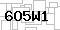
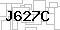
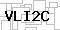
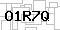

# simple-captcha

     

## Install

1. Clone this repository

```bash
git clone https://github.com/SS47816/simple-captcha.git
cd simple-captcha
```

2. Install all Dependencies

```bash
# Auto install conda env simple-captcha
make install
conda activate simple-captcha

# Auto install all pip dependencies from requirements.txt
make pip-install
```

## Usage

```bash
# Run single inference on the `./data/input/input100.jpg`
python3 simple-captcha/scripts/demo.py

# or optionally you can change the input/output paths
python3 simple-captcha/scripts/demo.py --im_path <YOUR_IMAGE_FILE> --save_path <YOUR_TXT_FILE>

# Run all inference on all images in `./data/input/` (as a test)
python3 simple-captcha/test/captcha.test.py
```

## General Idea

Based on the problem description, a simple conventional template matching approach is adopted for the problem for the following reasons:

- The number of characters and their sizes, locations, and spacings are all fixed. --> We can mannually locate the bounding box of each character and crop them.
- The font is fixed and there is no skew --> The look of each character is mostly unchanged across different images --> We can create a simple template for each character.
- The background and foreground colors, textures remain largely the same. --> Maybe we can "minus" these distracting factors for all images if needed (although eventually I didn't use this as the results are already quite accurate, the backgrounds/foregrounds are mostly removed during thresholding)
- The number of sample data provided is very limited (only 25 samples), may not be sufficient to train/finetune a model up to near 100% accuracy.
  - We can design a simple CNN model here to classify/detect the characters. But it may need additional data and may not perform as consistently as a simple conventional approach.
  - A simple template matching algorithm hand-crafted for this task can be faster to implement and achieves near 100% accuracy

Considering the above factors, I decided to use a template matching algorithm to solve the problem:

1. Assemble the sample training images and labels into a customized training dataset
2. Manually define the bounding box of each character in the training image
3. Extract the templates for all characters (`0`-`9`, `A`-`Z`) into a dictionary
   - For multiple occurcances of the same characters in the training set, the average image is taken as the template
4. On a test image, match this dictionary of templates to each bounding box location, and record their matching scores
5. Take the template with the max score as the best match
6. Collect all 5 predicted characters in the same image and save to a `.txt` file

The details are implemented in `simple-captcha/pipeline/captcha.py`

## License

This repository is licensed under the [MIT License](https://github.com/SS47816/simple-captcha/blob/master/LICENSE)

<small><p>Project based on <a target="_blank" href="https://github.com/nestauk/ds-cookiecutter">Nesta's data science project template</a>
