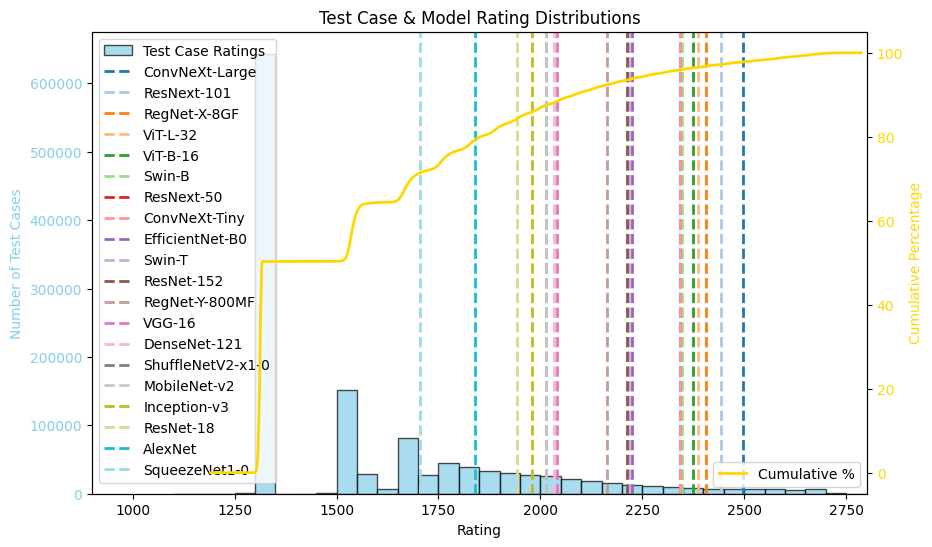

# AI-ELO

<!-- **[[Paper](https://arxiv.org/abs/2309.14685)] [[Project Page](https://ss47816.github.io/DriveSceneGen/)] [[Code](https://github.com/SS47816/DriveSceneGen)]** -->

#### (Let's find a better name ~~)

## AI-ELO: An Unified Framework for Modelling Generic Task Difficulties, AI and Human Performances

**[[Paper Draft](https://drive.google.com/file/d/1W6GFEvtZCEyVzD9KfY3M6Rr7Dtgxy_Ff/view?usp=sharing)] [[Project Google Drive](https://drive.google.com/drive/folders/1gNlDmO09IeKzWnpS1v2s0EK806-afbAD?usp=sharing)] [[Code](https://github.com/SS47816/DriveELO)]**



<!-- _Shuo Sun<sup>†</sup>, Zekai Gu<sup>†</sup>, Tianchen Sun<sup>†</sup>, Jiawei Sun, Chengran Yuan, Yuhang Han, Dongen Li, and Marcelo H. Ang Jr._ -->

<!-- _Advanced Robotics Centre, National University of Singapore_ -->

<!-- _<sup>†</sup>Indicates Equal Contribution_ -->

<!-- ## Abstract

> Realistic and diverse traffic scenarios in large quantities are crucial for the development and validation of autonomous driving systems. However, owing to numerous difficulties in the data collection process and the reliance on intensive annotations, real-world datasets lack sufficient quantity and diversity to support the increasing demand for data. This work introduces DriveSceneGen, a data-driven driving scenario generation method that learns from the real-world driving dataset and generates entire dynamic driving scenarios from scratch. Experimental results on 5k generated scenarios highlight that DriveSceneGen is able to generate novel driving scenarios that align with real-world data distributions with high fidelity and diversity. To the best of our knowledge, DriveSceneGen is the first method that generates novel driving scenarios involving both static map elements and dynamic traffic participants from scratch. Extensive experiments demonstrate that our two-stage method outperforms existing state-of-the-art map generation methods and trajectory simulation methods on their respective tasks. -->

## Install

1. Clone this repository

```bash
git clone https://github.com/SS47816/DriveELO.git
cd DriveELO
```

2. Install all Dependencies

```bash
# Auto install conda env DriveELO
make install
conda activate DriveELO

# Auto install all pip dependencies from requirements.txt
make pip-install
```

## CV Tasks

### Classification on ImageNet Dataset

1. Download the official [ImageNet Large-scale Visual Recognition Challenge (ILSVRC) 2012](https://www.image-net.org/download-images.php)

2. Organize the ImageNet dataset into the following structure:

   ```
   ImageNet/
   ├── imagenet_class_index.json
   │
   ├── train/
   │   ├── n01440764/  # Class: Tench
   │   │   ├── image1.jpg
   │   │   ├── image2.jpg
   │   │   ├── ...
   │   ├── n02102040/  # Class: English Springer
   │   │   ├── image1.jpg
   │   │   ├── image2.jpg
   │   │   ├── ...
   │   ├── ...
   │
   ├── val/
   │   ├── n01440764/  # Class: Tench
   │   │   ├── image1.jpg
   │   │   ├── image2.jpg
   │   │   ├── ...
   │   ├── n02102040/  # Class: English Springer
   │   │   ├── image1.jpg
   │   │   ├── image2.jpg
   │   │   ├── ...
   │   ├── ...
   ```

3. Run Inference & Rating Estimation

   ```bash
   python3 DriveELO/pipeline/classification.py --dataset_path <YOUR_IMAGENET_LOCATION>
   ```

### Object Detection on COCO 2017 Dataset

1. Download the official [COCO 2017 Dataset](https://cocodataset.org/#download)

2. Organize the COCO dataset into the following structure:

   ```
   COCO/
   ├── annotations/
   │   ├── instances_train2017.json  # Object detection annotations for training
   │   ├── instances_val2017.json    # Object detection annotations for validation
   │   ├── captions_train2017.json   # Image captions for training
   │   ├── captions_val2017.json     # Image captions for validation
   │   ├── person_keypoints_train2017.json  # Keypoints for human pose estimation
   │   ├── person_keypoints_val2017.json    # Keypoints for validation
   │   ├── ...
   │
   ├── train2017/  # Training images
   │   ├── 000000000001.jpg
   │   ├── 000000000002.jpg
   │   ├── ...
   │
   ├── val2017/  # Validation images
   │   ├── 000000000101.jpg
   │   ├── 000000000102.jpg
   │   ├── ...
   │
   ├── test2017/  # Test images (without annotations)
   │   ├── 000000001001.jpg
   │   ├── 000000001002.jpg
   │   ├── ...
   ├── coco_labels.txt  # List of COCO class labels
   ├── coco_classes.json  # Mapping of class IDs to class names
   ├── README.md  # Dataset description and usage instructions
   ```

3. Run Inference & Rating Estimation

   ```bash
   python3 DriveELO/pipeline/classification.py
   ```

## NLP Tasks

### Qustion Answering on MMLU Dataset

1. Run Inference & Rating Estimation

   ```bash
   python3 DriveELO/pipeline/question_answering.py
   ```

### Math/Coding on ??? Dataset

1. TODO:

## Autonomous Driving Tasks

### Motion Prediction on Waymo Dataset

1. TODO:

### Motion Planning on NAVSIM Dataset

1. TODO:

<!-- ## BibTeX

If you find our work interesting, please consider citing our paper:

    @misc{sun2023drivescenegen,
        title={DriveSceneGen: Generating Diverse and Realistic Driving Scenarios from Scratch},
        author={Shuo Sun and Zekai Gu and Tianchen Sun and Jiawei Sun and Chengran Yuan and Yuhang Han and Dongen Li and Marcelo H. Ang Jr au2},
        year={2023},
        eprint={2309.14685},
        archivePrefix={arXiv},
        primaryClass={cs.RO}
    } -->

## License

This repository is licensed under the [Apache License 2.0](https://github.com/SS47816/DriveSceneGen/blob/main/LICENSE)

<small><p>Project based on <a target="_blank" href="https://github.com/nestauk/ds-cookiecutter">Nesta's data science project template</a>
